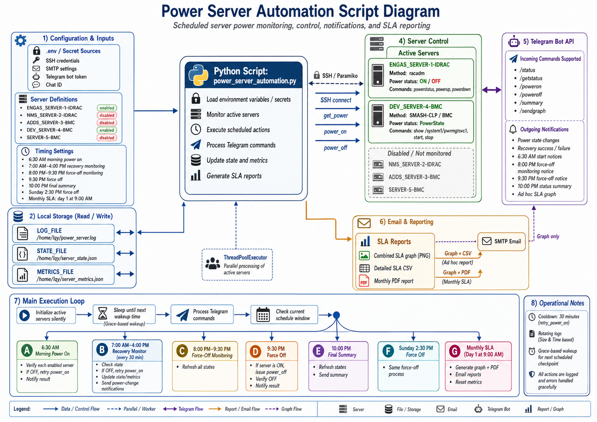

# ICTU Power Server Automation

A Python-based server power monitoring and automation tool for ICTU-managed servers. The script connects to Dell iDRAC or BMC-compatible management interfaces through SSH, checks server power state, performs scheduled power-on and force-off actions, sends Telegram notifications, and generates SLA reports through email.

## Overview

This project automates server power management for multiple configured servers. It supports scheduled morning power-on, daytime recovery monitoring, evening force-off, Telegram-based manual commands, and SLA report generation.

The automation script uses SSH to connect to each enabled server management controller. For iDRAC servers, it uses `racadm` power commands. For BMC servers, it uses `/system1/pwrmgtsvc1` commands.

## Main Features

- Automatic server power-on at **6:30 AM** from Monday to Saturday
- Recovery monitoring from **7:00 AM to 4:00 PM** from Monday to Saturday
- Automatic retry when a monitored server is detected as OFF during the recovery window
- Force-off monitoring from **8:00 PM to 9:30 PM**
- Scheduled force-off at **9:30 PM** from Monday to Saturday
- Final status summary at **10:00 PM**
- Sunday scheduled force-off at **2:30 PM**
- Telegram bot commands for live status and manual power control
- Monthly SLA email report every first day of the month at **9:00 AM**
- Ad hoc SLA graph generation through Telegram
- Email report with SLA graph and CSV attachment
- Local JSON-based state and metrics tracking
- Log rotation support
- Optional secret loading through HashiCorp Vault or system keyring

## Project Files

```text
.
├── power_server_automation.py   # Main automation script
├── example_env.env              # Sample environment configuration
├── README.md                    # Project documentation
└── .gitignore                   # Recommended: exclude .env, logs, state files, and virtual environment
```

## Requirements

### System Requirements

- Python 3.10 or higher recommended
- SSH access to iDRAC or BMC management interface
- Telegram bot token and chat ID for notifications
- SMTP account for email reports
- Linux server recommended for continuous service deployment

### Python Packages

Install the required Python packages:

```bash
pip install paramiko python-dotenv requests matplotlib reportlab
```

Optional packages if using Vault or keyring secret storage:

```bash
pip install hvac keyring
```

## Installation

### 1. Clone the Repository

```bash
git clone https://github.com/DV4LQY/Power-Server-Automation.git
cd Power-Server-Automation
```

### 2. Create a Python Virtual Environment

Linux/macOS:

```bash
python3 -m venv venv
source venv/bin/activate
```

Windows:

```bash
python -m venv venv
venv\Scripts\activate
```

### 3. Install Dependencies

```bash
pip install paramiko python-dotenv requests matplotlib reportlab
```

### 4. Create the `.env` File

Copy the sample environment file:

```bash
cp example_env.env .env
```

For Windows PowerShell:

```powershell
Copy-Item example_env.env .env
```

Then edit `.env` and fill in your actual server, SMTP, and Telegram credentials.

## Environment Variables

Create a `.env` file using this format:

```env
# -------- SSH (PER SERVER) --------
SSH1_HOST=
SSH1_PORT=22
SSH1_TYPE=idrac
SSH1_USER=
SSH1_PASS=

SSH2_HOST=
SSH2_PORT=22
SSH2_TYPE=idrac
SSH2_USER=
SSH2_PASS=

SSH3_HOST=
SSH3_PORT=22
SSH3_TYPE=bmc
SSH3_USER=
SSH3_PASS=

SSH4_HOST=
SSH4_PORT=22
SSH4_TYPE=bmc
SSH4_USER=
SSH4_PASS=

SSH5_HOST=
SSH5_PORT=22
SSH5_TYPE=bmc
SSH5_USER=
SSH5_PASS=

# -------- SMTP --------
SMTP_HOST=smtp.gmail.com
SMTP_PORT=587
SMTP_USER=
SMTP_PASS=
EMAIL_TO=

# -------- TELEGRAM --------
TG_TOKEN=
TG_CHAT_ID=

# -------- OPTIONAL SECRET MANAGEMENT --------
USE_VAULT=false
USE_KEYRING=false
VAULT_URL=
VAULT_TOKEN=
VAULT_SECRET_PATH=
```

> Important: Do not upload your real `.env` file to GitHub. Only upload `example_env.env`.

## Server Configuration

Servers are configured inside `power_server_automation.py` in the `SERVERS` list.

Example:

```python
{
    "name": "SERVER-1-IDRAC",
    "host": get_secret("SSH1_HOST"),
    "port": int(get_secret("SSH1_PORT")),
    "type": "idrac",
    "username": get_secret("SSH1_USER"),
    "password": get_secret("SSH1_PASS"),
    "enabled": True
}
```

### Supported Server Types

| Type | Description | Power Commands |
|---|---|---|
| `idrac` | Dell iDRAC server management | `racadm serveraction powerstatus`, `powerup`, `powerdown` |
| `bmc` | BMC-compatible management shell | `/system1/pwrmgtsvc1` commands |

### Enable or Disable a Server

To include a server in monitoring:

```python
"enabled": True
```

To skip a server:

```python
"enabled": False
```

## Runtime Files

By default, the script writes logs and state files to:

```text
/home/rpi/power_server.log
/home/rpi/server_state.json
/home/rpi/server_metrics.json
```

If your Linux username or deployment path is different, edit these values in the script:

```python
LOG_FILE = "/home/rpi/power_server.log"
STATE_FILE = "/home/rpi/server_state.json"
METRICS_FILE = "/home/rpi/server_metrics.json"
```

Make sure the script has permission to write to the selected directory.

## Running the Script

Run the automation manually:

```bash
python power_server_automation.py
```

For Linux servers:

```bash
python3 power_server_automation.py
```

The script runs continuously and uses its own internal scheduler. Do not run it repeatedly through cron every minute. It should stay running as a background service.

## Schedule

| Time | Days | Action |
|---|---|---|
| 6:30 AM | Monday to Saturday | Scheduled server power-on |
| 7:00 AM to 4:00 PM | Monday to Saturday | Recovery monitoring every 30 minutes |
| 8:00 PM to 9:30 PM | Monday to Saturday | Force-off monitoring and state refresh |
| 9:30 PM | Monday to Saturday | Scheduled force-off |
| 9:35 PM | Monday to Saturday | Enabled summary checkpoint, currently disabled in script |
| 10:00 PM | Monday to Saturday | Final server status summary |
| 2:30 PM | Sunday | Scheduled force-off |
| 9:00 AM | Every 1st day of the month | Monthly SLA report |

## Telegram Commands

The Telegram bot accepts the following commands:

```text
/help
/start
/status <server_name_or_host>
/getstatus <server_name_or_host>
/poweron <server_name_or_host>
/poweroff <server_name_or_host>
/summary
/sendgraph
/send graph
```

### Examples

Check server status:

```text
/status ENGAS_SERVER-1-IDRAC
```

Power on a server:

```text
/poweron ENGAS_SERVER-1-IDRAC
```

Power off a server:

```text
/poweroff DEV_SERVER-4-BMC
```

Get all enabled server statuses:

```text
/summary
```

Send an ad hoc SLA graph:

```text
/sendgraph
```

## Email and SLA Reports

The script sends email through the configured SMTP server. Gmail SMTP is supported when using an app password.

Monthly SLA reports include:

- Server uptime percentage
- Downtime minutes
- Recovery count
- Failure count
- SLA graph attachment
- PDF report attachment

Ad hoc SLA reports requested through Telegram include:

- SLA graph sent to Telegram
- SLA graph and detailed CSV sent through email

## Running as a Linux Service

Create a systemd service file:

```bash
sudo nano /etc/systemd/system/power-server-automation.service
```

Paste and adjust the paths:

```ini
[Unit]
Description=ICTU Power Server Automation
After=network-online.target
Wants=network-online.target

[Service]
Type=simple
User=rpi
WorkingDirectory=/home/rpi/power-server-automation
ExecStart=/home/rpi/power-server-automation/venv/bin/python /home/rpi/power-server-automation/power_server_automation.py
Restart=always
RestartSec=10
Environment=PYTHONUNBUFFERED=1

[Install]
WantedBy=multi-user.target
```

Reload systemd:

```bash
sudo systemctl daemon-reload
```

Enable the service on boot:

```bash
sudo systemctl enable power-server-automation
```

Start the service:

```bash
sudo systemctl start power-server-automation
```

Check service status:

```bash
sudo systemctl status power-server-automation
```

View live logs:

```bash
journalctl -u power-server-automation -f
```

## Troubleshooting

### `ValueError: invalid literal for int()`

This usually means an SSH port or SMTP port is blank in `.env`.

Fix:

```env
SSH1_PORT=22
SMTP_PORT=587
```

### Telegram messages are not sending

Check:

```env
TG_TOKEN=
TG_CHAT_ID=
```

Also confirm that the bot was started in Telegram and that the chat ID is correct.

### Email is not sending

Check:

```env
SMTP_HOST=smtp.gmail.com
SMTP_PORT=587
SMTP_USER=your_email@gmail.com
SMTP_PASS=your_app_password
EMAIL_TO=recipient@example.com
```

For Gmail, use an app password.

### SSH connection fails

Check:

- Server management IP address
- SSH port
- Username and password
- Network firewall
- Whether SSH is enabled on iDRAC/BMC

### Log file permission error

If the script cannot write to `/home/rpi`, either create the path with correct permissions or change the log/state paths inside the script.

Example:

```bash
sudo chown -R rpi:rpi /home/rpi
```

## Suggested GitHub Upload Checklist

Before uploading to GitHub, include:

```text
power_server_automation.py
example_env.env
README.md
.gitignore
```

Do not upload:

```text
.env
power_server.log
server_state.json
server_metrics.json
venv/
__pycache__/
```

## License

This project is intended for internal ICTU server automation use. Add a license file if this repository will be shared publicly.

## Author

**DV4LQY**

---

## System Architecture Diagram



This diagram illustrates the full workflow of the Power Server Automation System:

The system includes:
- Configuration & Secrets Management
- SSH-based Server Control (iDRAC / BMC)
- Telegram Bot Command Interface
- Automated Scheduling Engine
- SLA Reporting (Email + Telegram)
- Logging, Metrics, and State Tracking
# Power-Server-Automation
