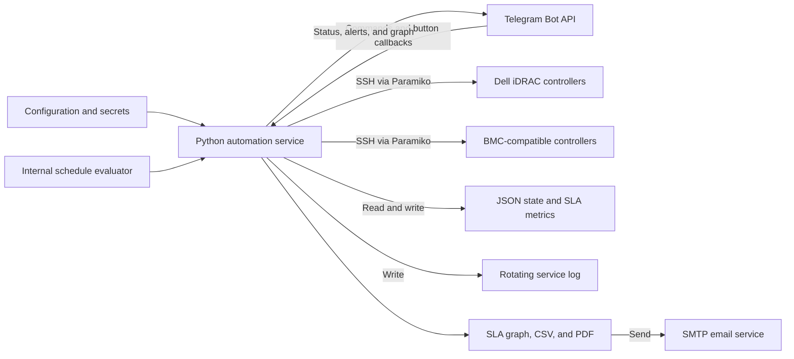
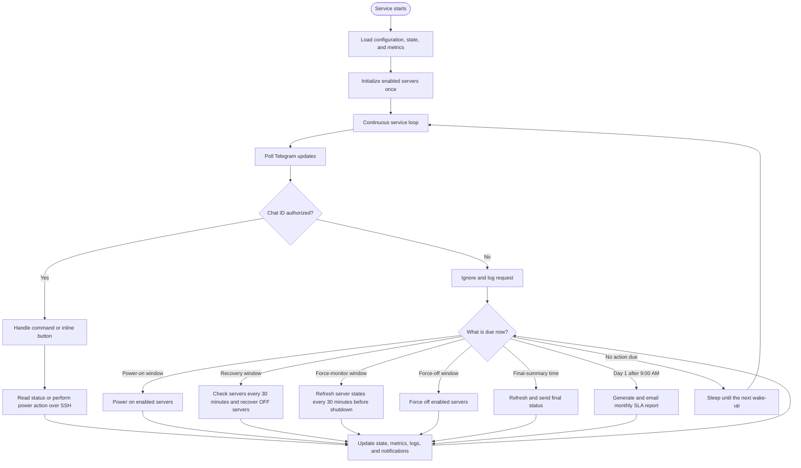
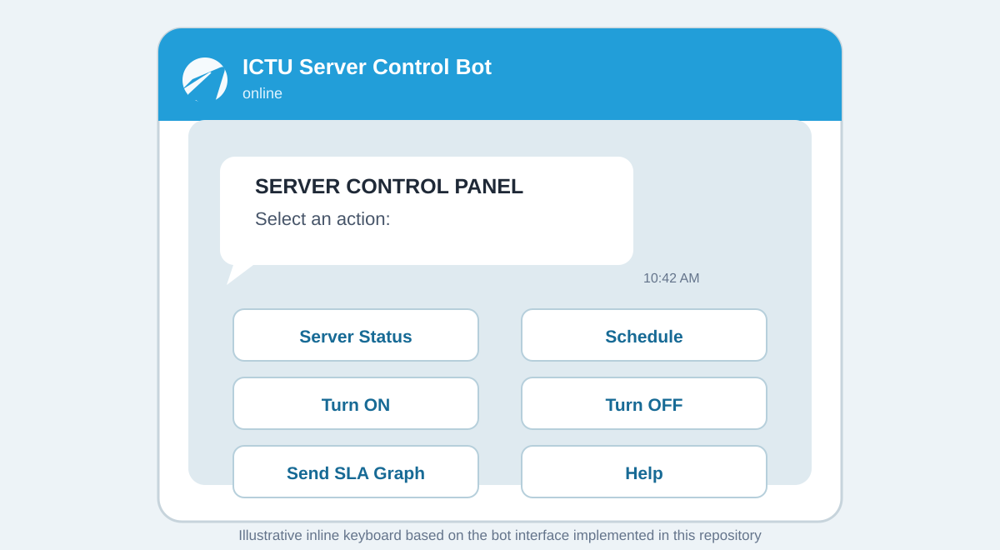

# ICTU Power Server Automation

A long-running Python service for monitoring and controlling ICTU-managed servers through their iDRAC or BMC management interfaces. It combines scheduled power actions, Telegram-based operator controls, email reporting, and local SLA metrics in one service.

All visuals in this README use GitHub-supported Markdown, Mermaid, and repository-relative assets.

## Contents

- [Features](#features)
- [Architecture](#architecture)
- [Workflow](#workflow)
- [Telegram control panel](#telegram-control-panel)
- [Project layout](#project-layout)
- [Requirements](#requirements)
- [Quick start](#quick-start)
- [Configuration](#configuration)
- [Automation schedule](#automation-schedule)
- [Telegram commands](#telegram-commands)
- [Reports and runtime data](#reports-and-runtime-data)
- [Linux service deployment](#linux-service-deployment)
- [Troubleshooting](#troubleshooting)
- [Security notes](#security-notes)

## Features

- Scheduled server power-on, recovery monitoring, force-off, and final status summaries
- SSH control of Dell iDRAC and BMC-compatible management interfaces through Paramiko
- Telegram command and inline-button interface for live status, power control, schedules, and SLA graphs
- Telegram notifications for scheduled activity, power changes, recoveries, failures, and summaries
- Monthly SLA email reports with graph and PDF attachments
- On-demand SLA graph delivery to Telegram, with graph and detailed CSV delivered by email
- Local JSON state and metrics files, rotating logs, retry/cooldown behavior, and concurrent server checks
- Optional HashiCorp Vault or system-keyring secret lookup, with environment-variable fallback

## Architecture



### Full system diagram


*Caption: Source-aligned overview of the configuration, automation service, SSH controller flow, Telegram operations, persistent state, schedule, and SLA reporting. The PNG is rendered from the editable [SystemArchitectureDiagram.svg](SystemArchitectureDiagram.svg) source.*

The service is the control point: it reads the configured secrets, evaluates the current local time, communicates with enabled server controllers over SSH, persists operational state, and sends operator-facing results through Telegram and email.

## Workflow



One-time scheduled actions are recorded in the state file so they run no more than once per applicable date. Recovery monitoring and pre-shutdown state refreshes run in 30-minute slots during their configured windows.

## Telegram control panel



*Caption: The inline Telegram control panel shown after <code>/start</code> or <code>/menu</code>. It provides the same primary actions as the text-command interface; server-selection screens follow the Status, Turn ON, and Turn OFF actions.*

| Control | Result |
|---|---|
| **Server Status** | Opens a server selector and includes an option for all active servers. |
| **Schedule** | Shows the active weekday/weekend automation timetable. |
| **Turn ON** | Opens a selector, then powers on the chosen server. |
| **Turn OFF** | Opens a selector, then sends a force-off command to the chosen server. |
| **Send SLA Graph** | Sends the current graph to Telegram and sends the graph plus detailed CSV to email. |
| **Help** | Displays the supported text commands and configured server targets. |

## Project layout

```text
.
├── power_server_automation.py       # Main long-running service
├── example_env.env                  # Safe configuration template
├── README.md                        # GitHub documentation
├── SystemArchitectureDiagram.png    # Rendered architecture visual used by the README
├── SystemArchitectureDiagram.svg    # Editable source for the architecture visual
└── docs/
    └── telegram-control-panel.svg   # README Telegram UI visual
```

## Requirements

- Python 3.10 or later
- SSH reachability to each iDRAC or BMC management interface
- A Telegram bot token and the authorized Telegram chat ID
- SMTP credentials for email reports
- A Linux host is recommended for an always-on service deployment

Install the required packages:

```bash
pip install paramiko python-dotenv requests matplotlib reportlab
```

Install these only when using the related secret provider:

```bash
pip install hvac keyring
```

## Quick start

1. Clone the repository and enter it.

   ```bash
   git clone https://github.com/DV4LQY/Power-Server-Automation.git
   cd Power-Server-Automation
   ```

2. Create and activate a virtual environment.

   Linux or macOS:

   ```bash
   python3 -m venv venv
   source venv/bin/activate
   ```

   Windows PowerShell:

   ```powershell
   python -m venv venv
   .\venv\Scripts\Activate.ps1
   ```

3. Install the dependencies.

   ```bash
   pip install paramiko python-dotenv requests matplotlib reportlab
   ```

4. Create your private environment file.

   Linux or macOS:

   ```bash
   cp example_env.env .env
   ```

   Windows PowerShell:

   ```powershell
   Copy-Item example_env.env .env
   ```

5. Populate <code>.env</code>, review the <code>SERVERS</code> list and runtime paths in <code>power_server_automation.py</code>, then start the service.

   ```bash
   python power_server_automation.py
   ```

The script contains its own scheduler and is intended to stay running. Do not invoke it every minute through cron.

## Configuration

Use <code>example_env.env</code> as the starting point. Never commit your real <code>.env</code> file.

```env
# SSH credentials for the configured server slots
SSH1_HOST=192.0.2.10
SSH1_PORT=22
SSH1_USER=admin
SSH1_PASS=replace_me

# SMTP
SMTP_HOST=smtp.gmail.com
SMTP_PORT=587
SMTP_USER=sender@example.com
SMTP_PASS=app_password
EMAIL_TO=ops@example.com,admin@example.com

# Telegram
TG_TOKEN=replace_with_bot_token
TG_CHAT_ID=replace_with_authorized_chat_id
```

The current script defines five server slots. It converts every <code>SSH*_PORT</code> variable to an integer during startup, including slots marked disabled, so supply a numeric port for each configured slot (normally <code>22</code>). The <code>SSH*_TYPE</code> fields in the sample file are descriptive; the controller type is defined by each server entry in <code>SERVERS</code>.

### Server definitions

Edit the <code>SERVERS</code> list in <code>power_server_automation.py</code> to set the server name, source environment slot, controller type, and whether the server is included in automated monitoring.

```python
{
    "name": "SERVER-1-IDRAC",
    "host": get_secret("SSH1_HOST"),
    "port": int(get_secret("SSH1_PORT")),
    "type": "idrac",
    "username": get_secret("SSH1_USER"),
    "password": get_secret("SSH1_PASS"),
    "enabled": True,
}
```

| Type | Interface | Power actions |
|---|---|---|
| <code>idrac</code> | Dell iDRAC | <code>racadm serveraction</code> status, powerup, and powerdown actions |
| <code>bmc</code> | BMC-compatible shell | Commands under <code>/system1/pwrmgtsvc1</code> |

Set <code>"enabled": false</code> to exclude a server from scheduled monitoring and button-based server menus. The manual text-command lookup can still resolve configured server names or hosts.

### Optional secret providers

Set <code>USE_VAULT=true</code> and configure <code>VAULT_URL</code>, <code>VAULT_TOKEN</code>, and <code>VAULT_SECRET_PATH</code> to load secrets from HashiCorp Vault. Alternatively, set <code>USE_KEYRING=true</code> to use the system keyring. When neither provider returns a value, the service falls back to environment variables.

## Automation schedule

Times use the host's local clock. A scheduled action runs once when the process observes its corresponding time window.

| Day group | Time | Action |
|---|---:|---|
| Monday–Friday | 6:30–7:00 AM | Scheduled power-on |
| Monday–Friday | 7:00 AM–4:00 PM | Recovery check every 30 minutes |
| Monday–Friday | 8:00–10:15 PM | Refresh server state every 30 minutes before shutdown |
| Monday–Friday | 10:15–10:30 PM | Scheduled force-off |
| Monday–Friday | 10:30 PM | Final status summary |
| Saturday–Sunday | 7:30–8:00 AM | Scheduled power-on |
| Saturday–Sunday | 8:00 AM–4:00 PM | Recovery check every 30 minutes |
| Saturday–Sunday | 8:00–8:15 PM | Refresh server state every 30 minutes before shutdown |
| Saturday–Sunday | 8:15–8:45 PM | Scheduled force-off |
| Saturday–Sunday | 9:30 PM | Final status summary |
| First day of every month | After 9:00 AM | Send monthly SLA email report and reset monthly metrics |

## Telegram commands

The service only accepts messages and button callbacks from the chat ID stored in <code>TG_CHAT_ID</code>.

| Command | Purpose |
|---|---|
| <code>/start</code> or <code>/menu</code> | Open the control panel. |
| <code>/help</code> | Show usage help and configured targets. |
| <code>/schedule</code> | Show the current timetable. |
| <code>/status &lt;server_name_or_host&gt;</code> | Check one server; omit the argument to open the active-server selector. |
| <code>/getstatus &lt;server_name_or_host&gt;</code> | Alias for <code>/status</code>. |
| <code>/poweron &lt;server_name_or_host&gt;</code> | Power on a server; omit the argument to open the selector. |
| <code>/poweroff &lt;server_name_or_host&gt;</code> | Force off a server; omit the argument to open the selector. |
| <code>/summary</code> | Refresh and return the status of all active servers. |
| <code>/sendgraph</code> or <code>/send graph</code> | Generate an on-demand SLA graph and report bundle. |

Examples:

```text
/status SERVER-1-IDRAC
/poweron SERVER-1-IDRAC
/poweroff SERVER-4-BMC
/summary
/sendgraph
```

## Reports and runtime data

### SLA reports

| Trigger | Telegram result | Email result |
|---|---|---|
| <code>/sendgraph</code> | Current SLA graph | SLA graph and detailed CSV |
| Monthly schedule | — | SLA graph and PDF report |

The monthly job clears the metrics file after it finishes. The on-demand graph request does not reset those metrics.

### Runtime files

The current default paths are defined near the top of <code>power_server_automation.py</code>:

```text
/home/lqy/power_server.log
/home/lqy/server_state.json
/home/lqy/server_metrics.json
```

Create the directory with suitable ownership or change <code>LOG_FILE</code>, <code>STATE_FILE</code>, and <code>METRICS_FILE</code> before deployment.

## Linux service deployment

Create <code>/etc/systemd/system/power-server-automation.service</code> and adjust the user, project path, and virtual-environment path.

```ini
[Unit]
Description=ICTU Power Server Automation
After=network-online.target
Wants=network-online.target

[Service]
Type=simple
User=serveradmin
WorkingDirectory=/opt/power-server-automation
ExecStart=/opt/power-server-automation/venv/bin/python /opt/power-server-automation/power_server_automation.py
Restart=always
RestartSec=10
Environment=PYTHONUNBUFFERED=1

[Install]
WantedBy=multi-user.target
```

Then load and start the service:

```bash
sudo systemctl daemon-reload
sudo systemctl enable --now power-server-automation
sudo systemctl status power-server-automation
```

View live service logs:

```bash
journalctl -u power-server-automation -f
```

## Troubleshooting

| Symptom | Check |
|---|---|
| <code>ValueError: invalid literal for int()</code> | Set a numeric value for every <code>SSH*_PORT</code> and for <code>SMTP_PORT</code>. |
| Telegram messages do not arrive | Verify <code>TG_TOKEN</code>, <code>TG_CHAT_ID</code>, the bot has been started, and the source chat ID matches exactly. |
| Email is not sent | Verify SMTP host, port, credentials, recipient list, and any app-password requirement. |
| SSH connection fails | Verify the management IP, port, credentials, firewall rules, and that SSH is enabled on the controller. |
| File permission error | Ensure the service user can create and write the configured log, state, and metrics paths. |

## Security notes

- Keep <code>.env</code>, state data, logs, and report output out of source control.
- Restrict permissions on <code>.env</code>; for example, use <code>chmod 600 .env</code> on Linux.
- Use a dedicated, least-privileged management account where the controller supports it.
- Treat the Telegram chat ID as an authorization boundary and use a private operator chat.
- Review and rotate SSH, SMTP, Telegram, Vault, and keyring secrets on your normal security schedule.

## License

This project is intended for internal ICTU server automation use. Add an explicit license before redistributing it.
